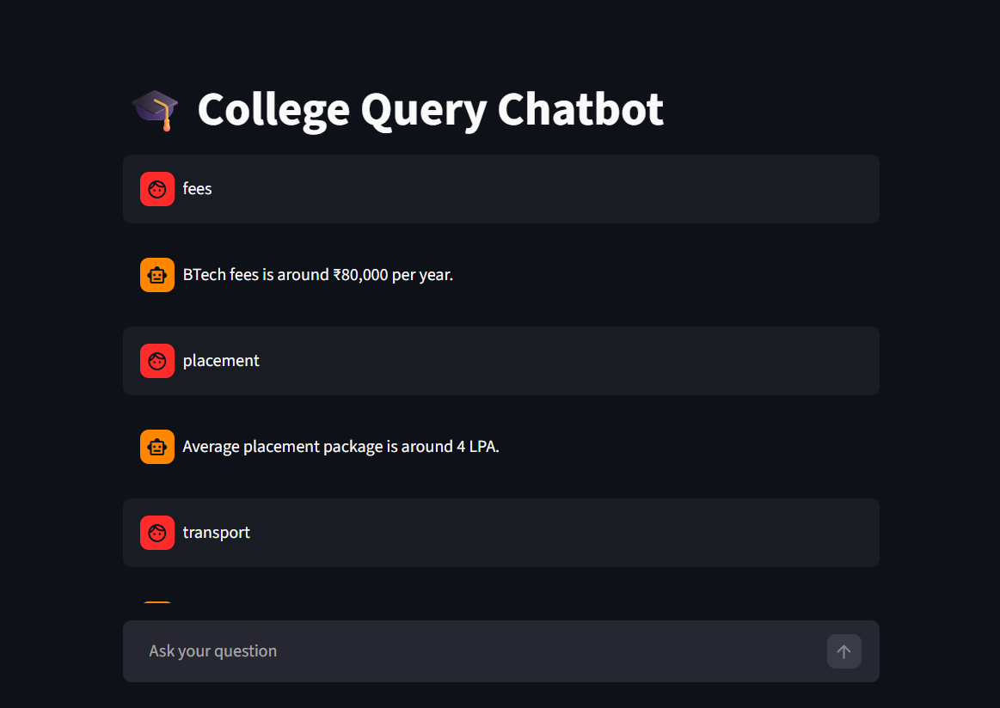

# College Query Chatbot

An AI-based chatbot developed using Python and Streamlit to answer student queries related to college fees, placements, timings, branches, and facilities.

## Features
- College FAQs
- Interactive Chat UI
- Fast Responses
- Simple NLP Logic

## Technologies Used
- Python
- Streamlit

## Run Project

```bash
python -m streamlit run app.py
## Screenshot

